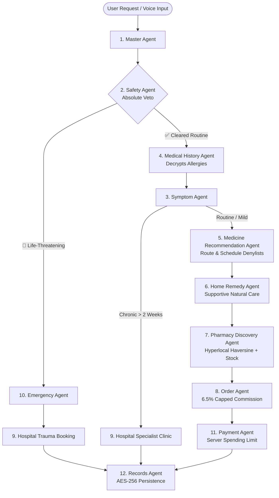

# 🩺 MediConnect — AI-Powered Hyperlocal Health & Pharmacy Platform

<div align="center">

[](https://sriviswanadhampabolu.github.io/mediconnect/)
[](https://fastapi.tiangolo.com)
[](https://www.python.org/)
[](https://flutter.dev/)
[](backend/tests)
[](#-data-privacy--encryption)
[](#-mission-constraint--ethical-guardrails)

<br />

**A full-stack, safety-first health assistant and hyperlocal pharmacy platform powered by a 12-agent orchestration graph.**  
Connecting patients directly with small neighborhood medical stores, eliminating predatory aggregator markups, offering generic price transparency, and preventing medical harm through automated safety shields.

[🌐 **Explore Live Web App**](https://sriviswanadhampabolu.github.io/mediconnect/) • [🎥 **Watch Demo Video**](#-demo-video--interactive-preview) • [🤖 **12-Agent Architecture**](#-12-agent-orchestration-architecture) • [🚀 **Quickstart**](#-quickstart--local-setup) • [📦 **API Reference**](#-api-endpoints-reference)

</div>

---

## 🌐 Live Application & Demo Links

| Resource | Link | Description |
| :--- | :--- | :--- |
| 🚀 **Live Web Simulator** | [**sriviswanadhampabolu.github.io/mediconnect**](https://sriviswanadhampabolu.github.io/mediconnect/) | Deployed, zero-setup interactive web console and mobile simulator |
| 📚 **Interactive Swagger API** | `http://127.0.0.1:8000/docs` | Auto-generated OpenAPI specs and live sandbox |
| 📱 **Cross-Platform Mobile App** | [`/mediconnect_flutter`](mediconnect_flutter/) | Production Flutter client (Android, iOS, Web & Desktop) |

---

## 🎥 Demo Video & Interactive Preview

> [!TIP]
> **Demo Video Placeholder:** Add your video recording link or embed below (e.g. YouTube, Loom, or direct GitHub media upload).

<div align="center">

### 📺 Watch the Platform Walkthrough

<!-- Replace the URL below with your YouTube, Loom, or MP4 link -->
[](https://sriviswanadhampabolu.github.io/mediconnect/)

*(Click above or embed your demo video link here)*

```markdown
<!-- To embed a video directly on GitHub: -->
<!-- Drag & drop your .mp4 / .webm video file right into this markdown file in GitHub's edit mode -->
```

</div>

---

## 🌟 Mission Constraint & Ethical Guardrails

Unlike monopolistic aggregators that charge exorbitant 25–35% fees and push white-labeled supply chains, MediConnect is built with immutable architectural guardrails:

```
┌──────────────────────────────────────────────────────────────────────────────┐
│                       MEDICONNECT BUSINESS GUARDRAILS                        │
├──────────────────────────┬───────────────────────────────────────────────────┤
│ 🏷️ Low Capped Commission │ Strictly capped at 6.5% (enforced server-side)    │
│ 💬 Direct Chemist Trust  │ Direct phone & live chat with local store owners   │
│ 💊 Generic Transparency │ Automatic 60–70% savings calculator on triage     │
│ 🔒 Server-Side AutoPay   │ ₹1,500 spending threshold requiring 2-step veto   │
│ 🛡️ Strict Route Denylist │ 100% block on eye/ear drops & prescription opioids│
└──────────────────────────┴───────────────────────────────────────────────────┘
```

1. **Low Capped Commission (6.5%):** neighborhood chemist commission is hardcoded at server level (`backend/config.py`). Aggregator gouging is structurally impossible.
2. **Direct Chemist Chat & Calls:** Patients can live-call and chat with local pharmacists, preserving local relationships.
3. **Generic Savings Engine:** Automatically compares branded vs. generic formulations during triage and checkout (e.g., Crocin ₹45 vs. Paracetamol ₹18).
4. **Server-Side Payment Limit:** Auto-pay is capped at a customizable threshold (default ₹1,500). Transactions exceeding the limit halt and demand explicit manual confirmation.
5. **Zero-Delay Emergency SOS:** Immediate ambulance ticket generation (108/102 integration) and hospital trauma ER admission holding passes.

---

## 🤖 12-Agent Orchestration Architecture



### 🧠 Specialist Agent Directory

| # | Agent Name | Primary Responsibility | Critical Guardrail / Constraint |
|---|:---|:---|:---|
| **1** | **Master Agent** | Orchestrates state routing and parses multimodal intents | Dispatches state execution breadcrumbs |
| **2** | **Safety Agent** | Evaluates emergency severity (chest pain, stroke, breathing) | **Absolute veto power**; interrupts non-urgent graph immediately |
| **3** | **Symptom Agent** | Predicts conditions and identifies chronic timelines | Symptoms > 2 weeks bypass auto-meds and route to clinics |
| **4** | **Medical History Agent** | Decrypts documented allergies & past prescriptions | Delivers denylist to Medicine Agent *prior* to triage |
| **5** | **Medicine Recommendation** | Selects candidate generic medications | Blocks eye/ear/nose drops, antibiotics, and contraindications |
| **6** | **Home Remedy Agent** | Suggests supportive, non-pharmaceutical recovery care | Provided alongside generic meds for gentle relief |
| **7** | **Pharmacy Agent** | Locates verified shops using Haversine GPS calculations | Prioritizes nearest verified chemists (<1 km) with inventory |
| **8** | **Order Agent** | Assembles purchase items with transparent financial breakdown | Enforces 6.5% capped commission constant |
| **9** | **Hospital Agent** | Auto-books priority ER admission passes or specialty clinic visits | Pre-clears trauma tokens (`ER-PASS`) for zero-waiting arrival |
| **10** | **Emergency Agent** | Dispatches ambulance (108) and alerts emergency contacts | Broadcasts live GPS coordinates via SMS webhook |
| **11** | **Payment Agent** | Validates UPI AutoPay against user spending ceiling | Rejects automated transactions exceeding limit (e.g. ₹1,500) |
| **12** | **Records Agent** | Writes encrypted diagnoses and medical orders to SQLite | Field-level **AES-256** encryption with immutable audit logs |

---

## 👥 Dual Persona Experience

MediConnect provides specialized interfaces tailored to both sides of the neighborhood healthcare ecosystem:

### 1. 👤 Patient / Customer Mode
- **Multimodal AI Triage:** Voice transcript input or text description with instant symptom analysis.
- **Generic Price Comparison:** Save up to 70% by opting for verified generic equivalents.
- **1-Tap Medicine Ordering:** Order directly from nearby chemists with live tracking (~15 min delivery).
- **Personalized Health Card:** Encrypted allergy shield (e.g., Aspirin, Ibuprofen, Sulfa) and medication history.
- **1-Tap Emergency SOS:** Instant ambulance dispatch and emergency hospital admission pass.

### 2. 🏪 Neighborhood Pharmacy Owner Mode
- **Live Inventory Management:** Real-time stock counts with quick +/- adjustments.
- **Incoming Orders Feed:** Accept deliveries and pack orders with zero aggregator penalty.
- **Direct Patient Connect:** Two-way communication with local customers to build neighborhood loyalty.
- **Local SOS Node:** Fast dispatch coordination for neighborhood medical emergencies.

---

## 🔐 Data Privacy & Encryption

```
┌────────────────────────────────────────────────────────┐
│               FIELD-LEVEL AES-256 STORAGE              │
├────────────────────────────┬───────────────────────────┤
│ Patient Medical Diagnoses  │ AES-256 / Fernet CBC      │
│ Documented Drug Allergies  │ Encrypted JSON array      │
│ Active Prescriptions       │ Field-level tokenization  │
│ Emergency Contact Data     │ Ciphertext at rest        │
│ Access Audit Trail         │ SHA-256 Immutable chain   │
└────────────────────────────┴───────────────────────────┘
```

All sensitive patient health information (PHI) is encrypted at rest using AES-256 before writing to SQLite/PostgreSQL. Decryption occurs only in memory inside specialist agent nodes when explicitly servicing user requests.

---

## 📂 Repository Structure

```
localmedai/
├── .github/
│   └── workflows/
│       ├── deploy-pages.yml          # GitHub Pages CI/CD workflow
│       └── tests.yml                 # Automated pytest CI pipeline
│
├── backend/                          # FastAPI Backend & 12-Agent Graph
│   ├── main.py                       # App initialization & lifespan seeder
│   ├── config.py                     # Capped commission, encryption keys & settings
│   ├── database.py                   # SQLAlchemy engine & session manager
│   ├── seed_data.py                  # Catalog of 68+ medicines & pharmacy clusters
│   ├── requirements.txt              # Backend dependencies
│   ├── agents/                       # 12 Specialist AI Agents
│   │   ├── master_graph.py           # Orchestration graph & conditional edges
│   │   ├── safety_agent.py           # Safety veto & emergency triage
│   │   ├── history_agent.py          # Allergy decryptor & prescription history
│   │   ├── symptom_agent.py          # Condition predictor & chronic duration checker
│   │   ├── medicine_agent.py         # Route & schedule denylists, allergy checks
│   │   ├── home_remedy_agent.py      # Supportive recovery care
│   │   ├── pharmacy_agent.py         # Hyperlocal Haversine pharmacy discovery
│   │   ├── order_agent.py            # Order calculations & capped commission
│   │   ├── hospital_agent.py         # Hospital ER & clinic slot booking
│   │   ├── emergency_agent.py        # Ambulance dispatch & SOS broadcast
│   │   ├── payment_agent.py          # Server-side payment cap validation
│   │   └── records_agent.py          # Encrypted database writer & audit trail
│   ├── api/                          # REST Endpoints
│   │   ├── routes_triage.py          # Triage & WebSocket endpoints
│   │   ├── routes_pharmacy.py        # Pharmacy discovery & order handling
│   │   ├── routes_records.py         # Health card & user profile
│   │   └── routes_emergency.py       # Emergency SOS trigger
│   ├── static/                       # Static Web App & Mobile Simulator
│   │   ├── index.html                # Web simulator markup
│   │   ├── styles.css                # Modern tactile glassmorphic CSS
│   │   └── app.js                    # Web application logic & offline fallbacks
│   └── tests/                        # Automated Unit Test Suite (21 Tests)
│       ├── test_agents.py            # Safety, allergy, and agent logic tests
│       ├── test_auth.py              # Login, demo users, and signup tests
│       ├── test_forgot_password.py   # 6-digit OTP verification tests
│       └── test_owner.py             # Pharmacy owner dashboard & inventory tests
│
├── docs/                             # GitHub Pages Static Deployment Source
│   ├── index.html                    # Mirror of web client for Pages hosting
│   ├── styles.css                    # Responsive stylesheet
│   └── app.js                        # Client script with persistent localStorage
│
└── mediconnect_flutter/              # Cross-Platform Flutter Mobile Application
    ├── pubspec.yaml                  # Flutter package dependencies
    └── lib/
        ├── main.dart                 # Application entry point & theme provider
        ├── core/constants/           # API URLs & configuration constants
        ├── models/                   # Dart data models (Triage, Pharmacy, Order)
        ├── providers/                # State management (Auth, Triage, Cart)
        └── screens/                  # 12 Production Flutter Screens
            ├── home_screen.dart             # Core triage & symptom discovery
            ├── auth_screen.dart             # Authentication & role selector
            ├── order_tracking_screen.dart   # Live order tracking & map
            ├── orders_list_screen.dart      # Purchase & appointments history
            ├── owner_dashboard_screen.dart  # Pharmacy inventory & stock manager
            ├── emergency_screen.dart        # 1-Tap SOS ambulance dispatch
            ├── hospital_booking_screen.dart # ER admission pass details
            └── records_screen.dart          # Encrypted health card & allergies
```

---

## 🚀 Quickstart & Local Setup

### 1. Prerequisites
- **Python 3.10+**
- **Flutter SDK 3.19+** (optional, for mobile app)
- **Git**

### 2. Backend & Web Simulator Setup

```bash
# Clone the repository
git clone https://github.com/sriviswanadhampabolu/mediconnect.git
cd mediconnect

# Create & activate a virtual environment
python -m venv venv
# On Windows:
.\venv\Scripts\activate
# On macOS/Linux:
source venv/bin/activate

# Install dependencies
pip install -r backend/requirements.txt

# Run the FastAPI server
python -m uvicorn backend.main:app --host 127.0.0.1 --port 8000 --reload
```

- 🖥️ **Web Simulator:** Open [**`http://127.0.0.1:8000/`**](http://127.0.0.1:8000/)
- 📖 **Interactive API Docs:** Open [**`http://127.0.0.1:8000/docs`**](http://127.0.0.1:8000/docs)

### 3. Run Automated Tests

The test suite validates safety vetoes, allergy denylists, commission caps, and encryption:

```bash
python -m pytest backend/tests -v
```

```
==================== 21 passed in 1.42s ====================
```

### 4. Run Flutter Mobile App

```bash
cd mediconnect_flutter
flutter pub get
flutter run
```

---

## 🔑 Demo Credentials

For quick local testing and evaluation, pre-seeded accounts are available:

| Role | Email | Password | Pre-Configured Attributes |
|---|---|---|---|
| **👤 Patient** | `rahul@health.in` | `Demo123!` | Documented Aspirin allergy, ₹1,500 limit, Sector 15 Gurgaon |
| **🏪 Pharmacy Owner** | `owner@sanjeevani.in` | `Demo123!` | Sanjeevani Local Chemist, full medicine inventory |

> [!NOTE]
> 1-Click login buttons are available directly on the web app login screen for instant demo access without typing.

---

## 📦 API Endpoints Reference

### 🩺 Triage & Emergency
- `POST /api/triage/message` — Full 12-agent symptom triage & medication recommendation
- `POST /api/emergency/trigger` — 1-Tap emergency SOS ambulance dispatch & hospital pass

### 🏪 Pharmacy & Orders
- `GET /api/pharmacy/nearby?query={query}` — Nearby chemist discovery with stock check
- `POST /api/pharmacy/orders/create` — Place medicine order with 6.5% capped commission
- `GET /api/pharmacy/orders/user/{user_id}` — User order history
- `GET /api/pharmacy/owner/dashboard/{pharmacy_id}` — Owner inventory & active store orders
- `POST /api/pharmacy/owner/inventory/{pharmacy_id}/update-stock` — Real-time inventory adjustment

### 🔒 Records & Profile
- `GET /api/records/user/{user_id}` — Fetch encrypted patient health card & allergies
- `POST /api/records/user/{user_id}/allergy` — Add and encrypt new allergy
- `PUT /api/records/user/{user_id}/profile` — Update address, GPS coordinates, and payment cap

---

## 📄 License & Attribution

Distributed under the **MIT License**. See `LICENSE` for more information.

Built with ❤️ for accessible, affordable, and safe neighborhood healthcare.